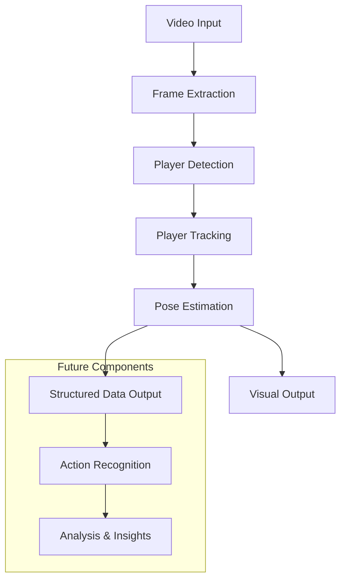
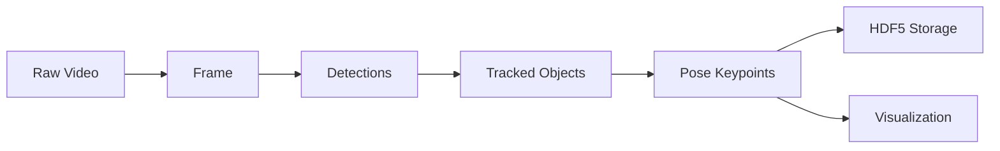
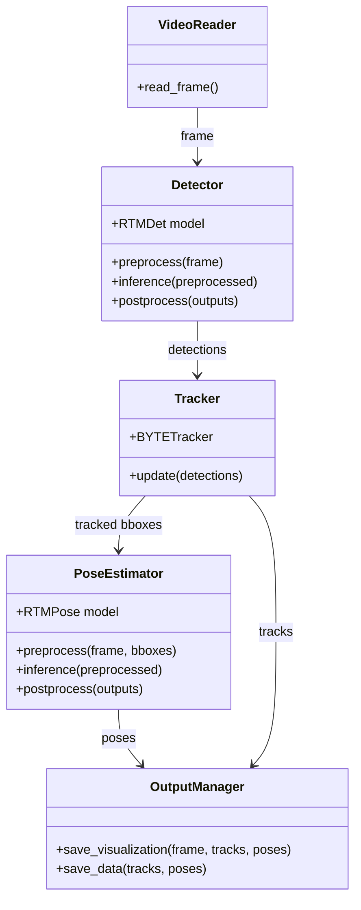

# System Patterns: HPE_volleyball

## System Architecture

The HPE_volleyball system follows a sequential pipeline architecture with distinct stages for processing video data. Each stage builds upon the previous one, creating a flow of increasingly refined information.



## Core Components

### 1. Video Input & Frame Extraction

- Uses OpenCV (`cv2.VideoCapture`) to read video frames
- Processes standard 1920x1080, 50fps video input
- Currently reads from local files in `/data/` directory
- Future: Will automatically detect and process new videos

### 2. Player Detection

- **Model**: RTMDet (from OpenMMLab)
- **Format**: ONNX model running on ONNX Runtime with CUDA backend
- **Input**: Full video frames
- **Output**: Bounding boxes with confidence scores
- **Implementation**: Uses RTMlib's RTMDet wrapper
- **Process Flow**:
  - Preprocessing (resize, normalize)
  - ONNX inference session
  - Postprocessing (decode predictions, NMS)

### 3. Player Tracking

- **Algorithm**: ByteTrack
- **Purpose**: Maintains consistent player IDs across frames
- **Input**: Detection bounding boxes and scores
- **Output**: Tracked objects with consistent IDs
- **Performance**: Very efficient (~1ms per frame)

### 4. Pose Estimation

- **Model**: RTMPose (from OpenMMLab)
- **Format**: ONNX model running on ONNX Runtime with CUDA backend
- **Input**: **Batch** of cropped images from tracked bounding boxes
- **Output**: Keypoint coordinates and confidence scores
- **Implementation**: Uses RTMlib's RTMPose wrapper (**modified for batch processing**)
- **Process Flow**:
  - **Batch** Preprocessing (crop, resize, normalize for all boxes)
  - **Single** ONNX inference session for the batch
  - **Batch** Postprocessing (decode keypoints for all boxes)

### 5. Output Generation

- **Visual Output**: OpenCV-rendered video with overlaid bounding boxes, IDs, and pose skeletons
- **Data Storage**: HDF5 file format for structured storage of:
  - Track IDs
  - Bounding boxes
  - Bounding box scores
  - Keypoints
  - Keypoint scores
  - Track presence index (which frames contain which tracks)

## Data Flow



## Key Technical Decisions

### 1. Model Selection

- **RTMDet & RTMPose**: Selected for balance of accuracy and speed
- **Model Sizes**: Medium-sized models chosen as baseline (RTMDet-m, RTMPose-m)
- **Rationale**: Provides good accuracy while maintaining reasonable inference speed

### 2. Inference Backend

- **ONNX Runtime with CUDA**: Chosen for cross-platform compatibility and GPU acceleration
- **Alternatives Considered**: TensorRT (faster but more complex), PyTorch (simpler but slower)
- **Rationale**: ONNX provides a good balance of performance and ease of deployment

### 3. Tracking Algorithm

- **ByteTrack**: Selected for its state-of-the-art performance and efficiency
- **Alternatives Considered**: DeepSORT, SORT, MOTDT
- **Rationale**: ByteTrack handles occlusions better and maintains ID consistency

### 4. Data Storage Format

- **HDF5**: Chosen for efficient storage of hierarchical numerical data
- **Alternatives Considered**: JSON (less efficient for numerical data), CSV (lacks hierarchical structure)
- **Rationale**: HDF5 provides efficient storage and retrieval of structured numerical data

## Performance Considerations

**Baseline Performance (Post-Normalization Optimizations, Pre-Batching):**
*   Detection Stage: ~17 ms/frame
*   Pose Estimation Stage: ~20 ms/frame (sequential processing)
*   Overall: ~22 FPS

**Current Performance (Post-Batch Pose Estimation):**
*   Detection Stage: ~19 ms/frame (stable)
*   Pose Estimation Stage: **~11 ms/frame** (significant improvement due to batching)
*   Overall: **~26 FPS**

Current performance profiling focus:

1. **Detailed Profiling**: Breaking down the time spent in each component of the inference pipeline:
   - Preprocessing time
   - Actual ONNX session inference time
   - Postprocessing time
   - Overhead (memory transfers, API calls, etc.)

2. **Identifying Low-Hanging Fruits**: Looking for optimization opportunities in:
   - Preprocessing operations
   - Postprocessing operations
   - Reducing overhead
   - Memory transfer optimizations

3. **ONNX Runtime Warnings**: Investigating warnings about operations being assigned to CPU instead of GPU:
   ```
   [W:onnxruntime:, session_state.cc:1168 onnxruntime::VerifyEachNodeIsAssignedToAnEp] Some nodes were not assigned to the preferred execution providers which may or may not have an negative impact on performance. e.g. ORT explicitly assigns shape related ops to CPU to improve perf.
   ```

## Component Relationships



## Future Architecture Extensions

1. **Action Recognition Module**: Will process pose sequences to identify volleyball-specific actions
2. **Automated Pipeline Trigger**: Will monitor for new videos and automatically initiate processing
3. **Analysis Dashboard**: Will provide coaches with insights derived from the processed data
